# Alkalmazás Fejlesztés Beadnadó
## Dokumentáció

##### Pál Szabolcs, E5M3EI
##### palszabcs@gmail.com

#Brainstrom börze

##1. Követelményanalízis

###1.1 Célkitűzés, projektindító dokumentum

A program legfőbb célja, hogy bárki segítséget találhasson egy projektjének a elkészítéséhez, akár megvalósításhoz kell, akár támogatót keres vagy csak egyszerűen nincs teljesen még kész a terv.
Az ötleteket, webes kliensel hozzuk létre, az adat védelem érdekében legyen lehetőség regisztrációra. A bejelentkezett felhasználó megtekintheti az ötletek listáját, tehet fel saját ötletet, törölheti azokat és megjegyzést írhat hozzájuk.

####Funkcionális követelmények:

- Regisztráció
- Bejelentkezés
- Bejelentkezett felhasználó funkció:
    - új ötlet feltöltése
    - meglévő ötletének szerkesztése
    - meglévő ötletének törlése
    - ötletek szűrése

####Nem funkcionális követelmények:

- Könnyű áttekinthetőség: színekkel és címkékkel külön csoportosítás.
- Használhatóság: Könnyű áttekinthetőség, logikus elrendezés, kezelhetőség.
- Megbízhatógás: jelszóvel védett funkciók, hibakezelés legyen áttekinthető.
- Karbantarthatóság: könnyen és gyorsan lehessen új szekciókkal bővíteni, régieket módosítani.

###1.2 Fogalomjegyzék

####Projekt típusok:
    - megvalósítás: szakmai segítség nyújtása, befektetés
    - támogatás: költségek kisegítése, adományozás
    - tervezés: befejezetlen projekt kiegészítése

###1.3. Használatieset-modell, funkcionális követelmények

####Vendég: Csak a publikus oldalakat éri el

- Főoldal
- Bejelentkezés
- Regisztráció

####Bejelentkezett felhasználó: A publikus oldalak elérésén felül egyéb funkciókhoz is hozzáfér.

- Új projekt felvétele
- Ötlet megtekintése
- Ötlet szerkesztése
- Ötlet törlése
- Ötlet szerkesztése

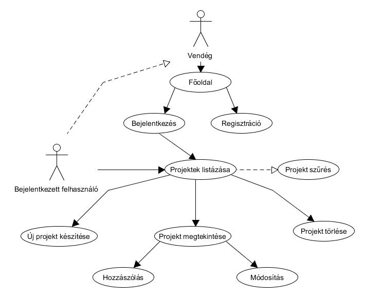
<<<<<<< HEAD

## 2. Tervezés

### Oldaltérkép

####Publikus:

- főoldal
- bejelentkezés
- regisztráció

####Bejelentkezett:

- ötletek
  - új ötlet
  - ötlet megtekintése
    - saját ötlet szerkesztése
    - saját ötlet törlése
  - ötletek szűrése

#### Design-tervek megvalósítása

Főoldal bejelentkezés nélkül
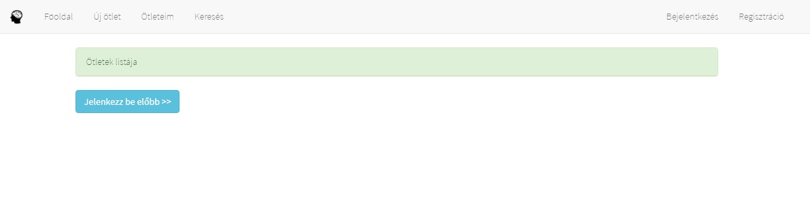

Főoldal
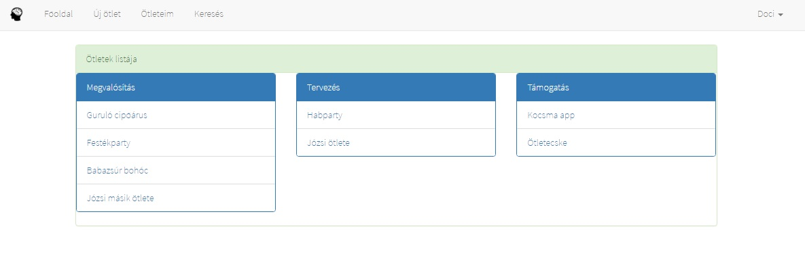

Regisztráció
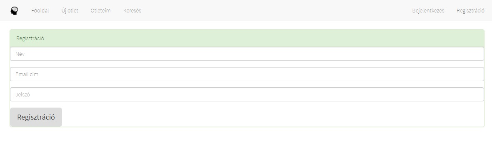

Bejelentkezés
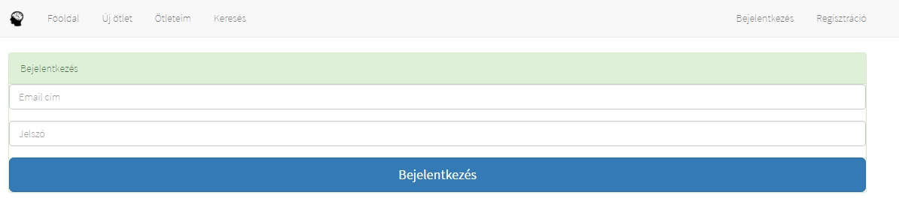

Ötlet részletek
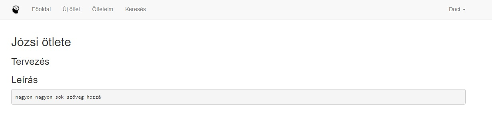

Saját ötletek
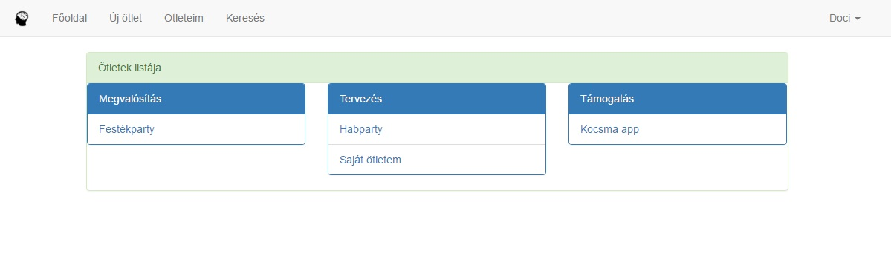

Saját ötlet részletek
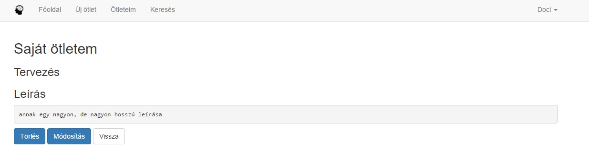

Ötletek szűrése
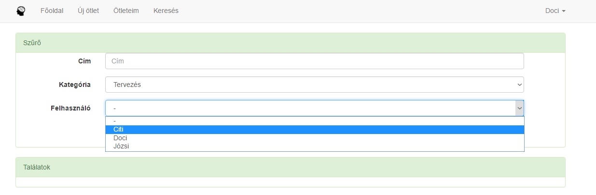

#### Adatbázis-kapcsolatok

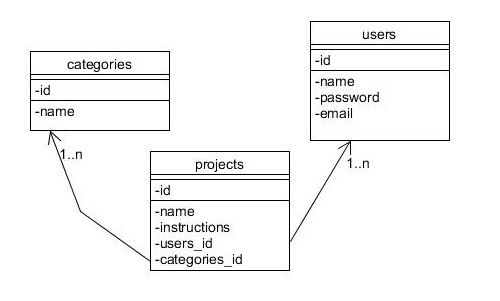

## 3. Implementáció

###Fejlesztőkörnyezet

**Visual Studio Code**

###Könyvtárstruktúra

###Funkciók

* popup_login.js - (AJAX) Belépés egy felugro ablakon kersztül, majda menüsor és a főoldal gombjainak is a frissitése
* popup_reg.js - (AJAX) Regisztráció felugro ablakban
* popup_add.js - (AJAX) Vásárlás hozzáadása egy felugro ablakban , sikeres létrehozás esetén a lista frissülése
* delete.js - Törlés elött egy felugró ablakban meg kell erősíteni a szándékunkat

## 4. Tesztelés

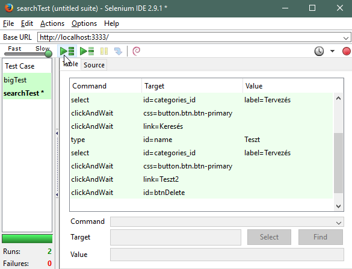

## 5. Felhasználói dokumentáció

**Futtatáshoz szükséges operációs rendszer:** Tetszőleges operációs rendszer

**A futtatáshoz szükséges hardver:** Operációs rendszerek szerint megadva

**Egyéb követelmények:** Internet böngésző telepítése, JavaScript ajánlott

**Program használata:**

1. Böngészőben nyissuk meg a főoldalt
2. Jobb felső sarokban kattintsunk a Bejelentkezés/Regisztráció gombra vagy a képernyő közepén kattintsunk a Bejelentkezés lehetőségre
3. Bejelentkezés/Regisztráció után a főoldalra jutunk
4. A fenti navigációs ablakban az Új ötlet felvitele, Saját ötleket listázása vagy Keresés gombra kattintva tudjuk a munkánkat folytatni
5. Amint az új ötletre kattintottunk, töltsük ki az űrlapot
6. Hibás adatok esetén az űrlap jelezni fogja a hibát
7. Küldés gombra kattintva mentsük el az adatokat
8. Ötleteim oldalon találjuk a saját ötleteinket ezekre kattintva megtekinhetjük a részleteket, módosíthatjuk vagy törölhetjük őket
9. Módosítás oldalon: A kiválasztott ötletet szerkeszthetjük
10. Vásárlások megtekintése oldalon: A kiválasztott vásárlást megtekinthetjük és szerkeszthetjük az űrlap helyes kitöltésével
11. A Keresés oldalon: általunk választott szűrési feltételekkel listázhatjuk ki az ötleteket